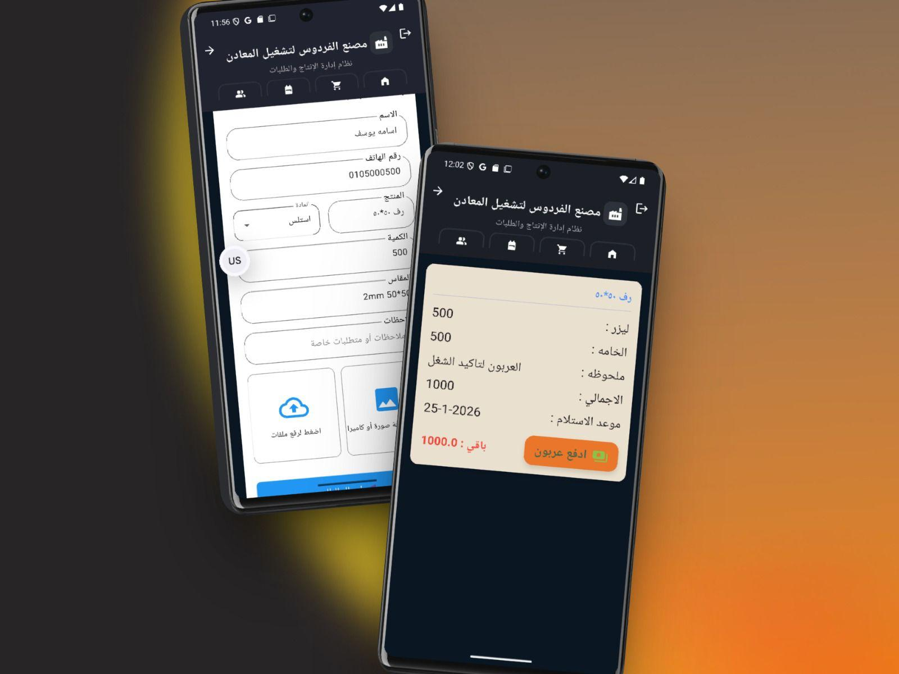
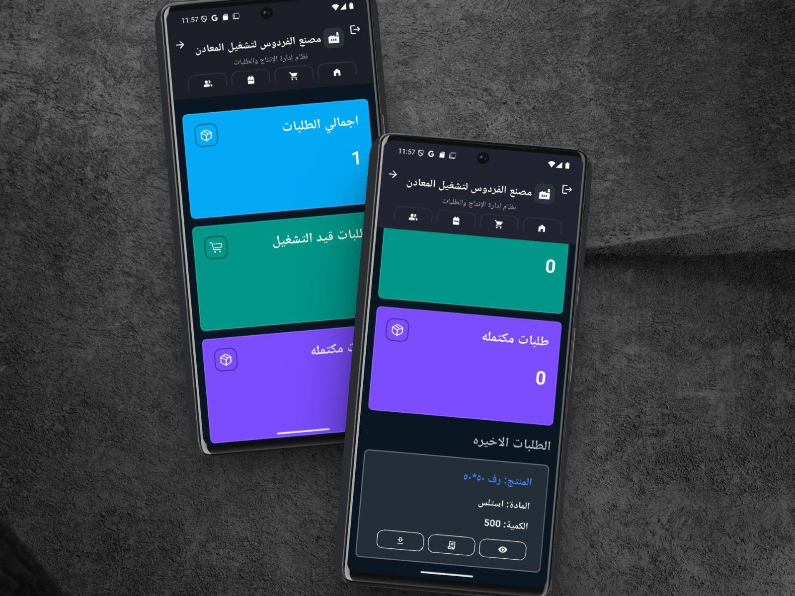
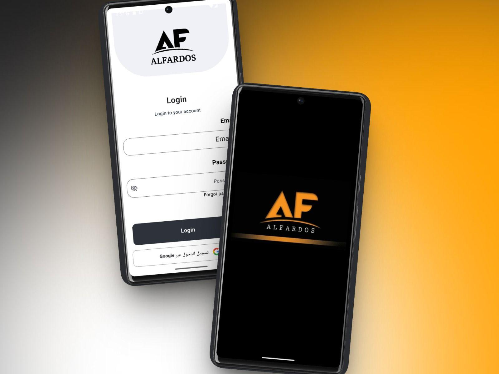
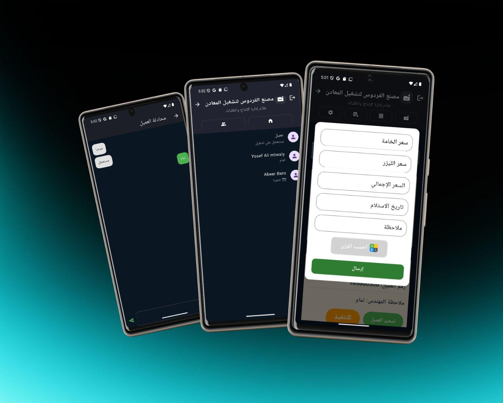
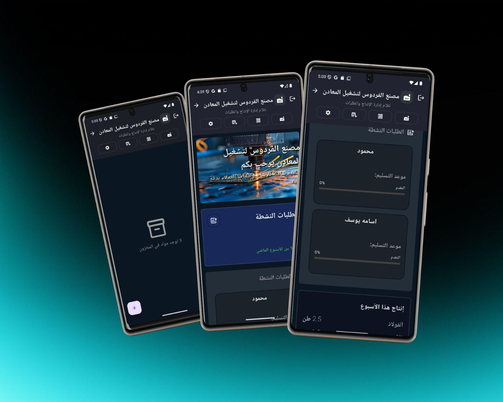
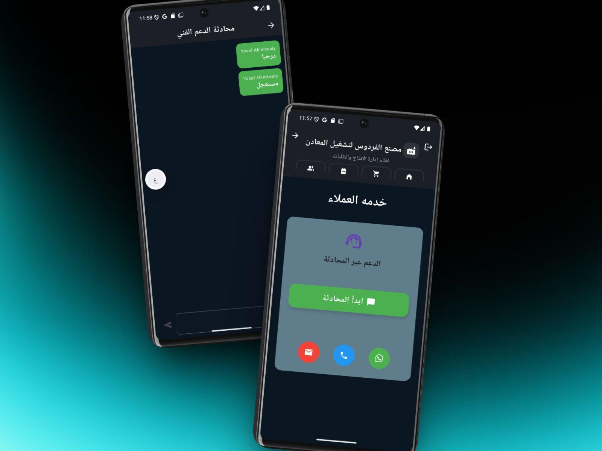
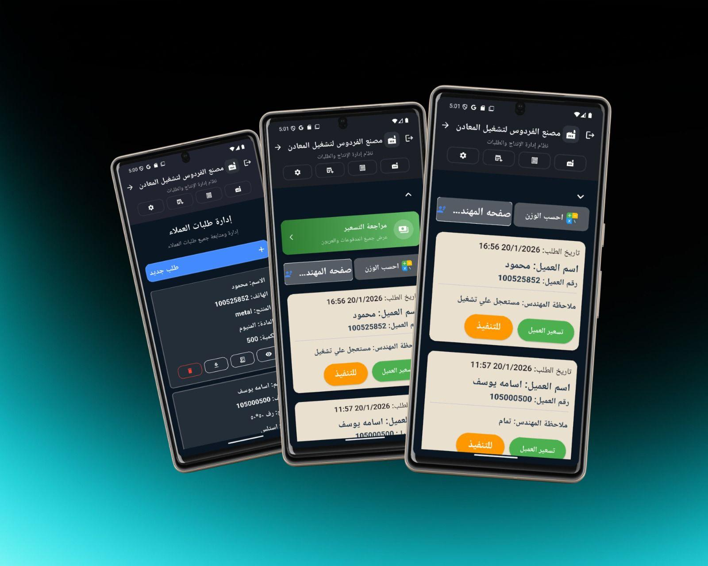

# Al-Fardos Factory Management System
### A full-scale Flutter application built for a real metal processing factory

> **Al-Fardos** is a production-grade mobile system that digitizes the entire order lifecycle of a metal manufacturing facility — from the moment a client submits a request, through engineering review, pricing, payment, and all the way to execution on the factory floor.

---

## Why This App Exists

Managing a metal processing factory involves four completely different types of users — clients, engineers, accountants/admins, and floor workers — each needing a different interface to do their job. Before this system, coordination between these roles relied on phone calls, paper notes, and manual follow-ups. Orders slipped through the cracks. Pricing took days. Clients had no visibility.

This app solves all of that in one unified platform.

---

## Four Interfaces, One App

The system uses **role-based authentication** to serve four completely different user types, each with a tailored experience:

---

### 1. Client Interface
The face the factory shows to its customers.

- Clients submit new orders by specifying the product type, material (e.g., stainless steel, aluminum), dimensions, quantity, and any special requirements — along with uploading reference drawings or photos directly from their phone.
- Once an order is submitted, clients can track it in real time: where it stands in the workflow, whether it's been reviewed by engineering, and when it's scheduled for delivery.
- Pricing arrives directly in the app — no need to call and ask. The client sees a full cost breakdown (raw material cost, laser cutting cost, total) and can pay the deposit right from within the app using an integrated payment flow.
- Every order has a **dedicated in-app chat channel** between the client and the factory team, so questions, revisions, and confirmations happen in one place rather than scattered across WhatsApp threads.

---

### 2. Engineer Interface
Built for the engineers who review incoming orders and produce the technical drawings.

- Engineers see a live feed of incoming orders assigned to them, including all client-submitted specs and attachments.
- After reviewing, the engineer adds their technical notes and uploads the completed drawing directly to the order.
- Once the drawing is ready, it's automatically forwarded to accounting for pricing — no manual handoff needed.
- Engineers can flag orders as urgent, which surfaces them to the admin dashboard immediately.

---

### 3. Admin & Accounting Interface
The control center of the entire factory.

- Admins have a **complete real-time overview**: total orders, orders currently in production, completed orders, and a running feed of this week's output by material type and tonnage.
- The pricing workflow is centralized here: once an engineer submits a drawing, the accountant enters raw material cost, laser cost, total, delivery date, and a note — and the pricing is pushed to the client instantly.
- Admins can browse into any engineer's order queue directly.
- If a client doesn't have the app, the admin can create an order on their behalf — and the order flows through the system exactly as if the client had submitted it themselves.
- Full order history and status tracking (pending, in production, completed, blocked).

---

### 4. Floor Worker Interface
The simplest interface in the system — by design.

- Workers on the factory floor see a clean, prioritized list of production orders in the sequence they need to be executed.
- Two actions per order: **"Start"** (marks the order as in production) and **"Done"** (marks it as complete).
- The moment a worker taps "Done," the order status updates across the entire system in real time — the admin sees it, the engineer sees it, and the client's tracking reflects it.

---

## Technical Details

| Area | Stack |
|------|-------|
| Framework | Flutter (Dart) |
| Architecture | Clean separation per user role |
| Auth | Role-based login (4 roles) |
| Real-time | Live order status updates |
| Chat | In-app messaging per order |
| File handling | Drawing uploads (image & file) |
| Payments | Deposit payment flow with confirmation |
| State management | Bloc (flutter_bloc) |
| Backend | Firebase (Firestore, Auth, Storage) |

---

## Screens Overview

| Screen | Role |
|--------|------|
| Splash + Login | All users |
| Client dashboard — order tracking, active orders, production progress | Client |
| Order submission form — product, material, dimensions, quantity, notes, file upload | Client |
| Pricing summary — material cost, laser cost, total, deposit button | Client |
| In-app support chat | Client |
| Engineer order queue — flagged urgent orders visible | Engineer |
| Admin overview — total / in-production / completed counters | Admin |
| Admin pricing form — material price, laser price, total, delivery date | Admin |
| Admin order management — create orders on behalf of clients | Admin |
| Floor worker queue — prioritized order list with Start / Done actions | Worker |

---

## What Makes This Project Different

Most portfolio projects are todo apps or weather apps pulled from tutorials. This one was built to solve a real operational problem for a real manufacturing business.

The system handles:
- A **complete business workflow** from order intake to delivery confirmation
- **Four distinct user roles** with isolated permissions and purpose-built UIs
- **Real-time state** that propagates across all roles instantly
- A **payment flow** with deposit tracking and outstanding balance display
- **In-context communication** so nothing gets lost outside the app

It was designed, built, and deployed for actual daily use — not as a demonstration.

---

## Screenshots

### Client & Admin Order Management

### Order Submission Form & Pricing Summary

### Admin Dashboard — Live Order Counters

### Splash Screen & Login

### Pricing Form & In-App Chat

### Client Home & Active Orders Tracking

### Customer Support Chat

---

## Contact

Built by **Osama Yosef** — Flutter Developer  
📧 osamayosef038@gmail.com  
💼 [LinkedIn — Osama Yosef](https://www.linkedin.com/in/osama-yosef-819268319)
