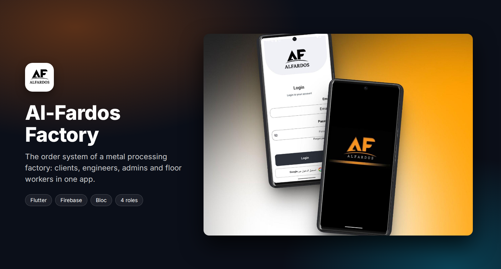
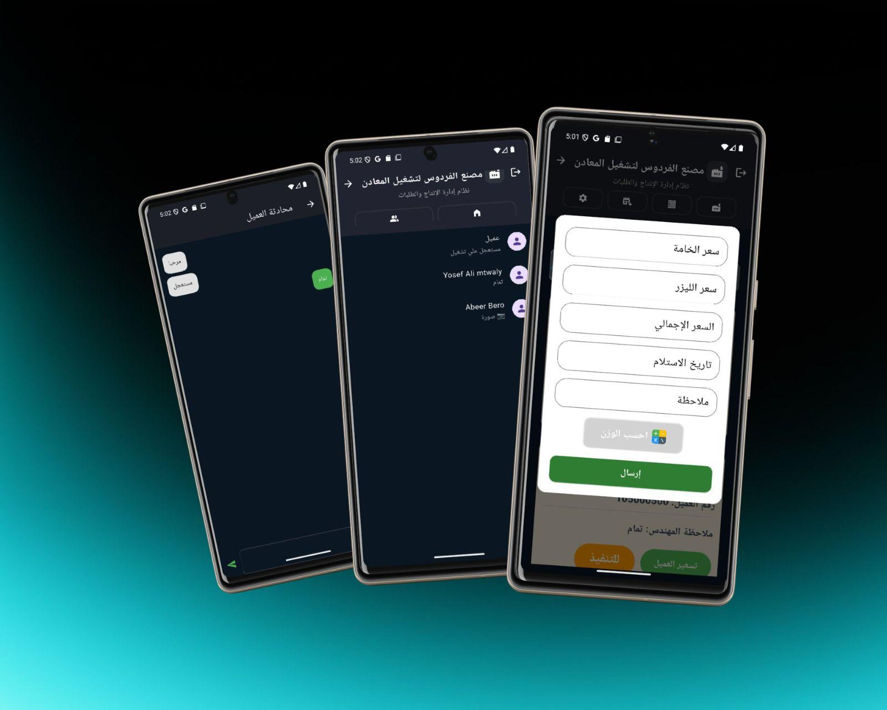
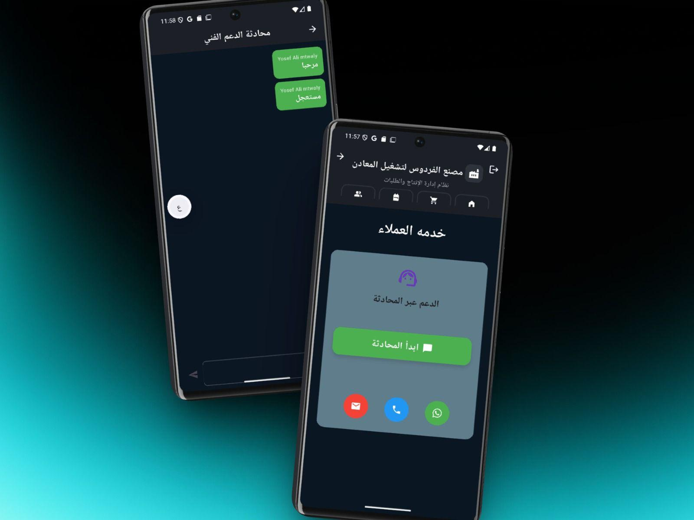
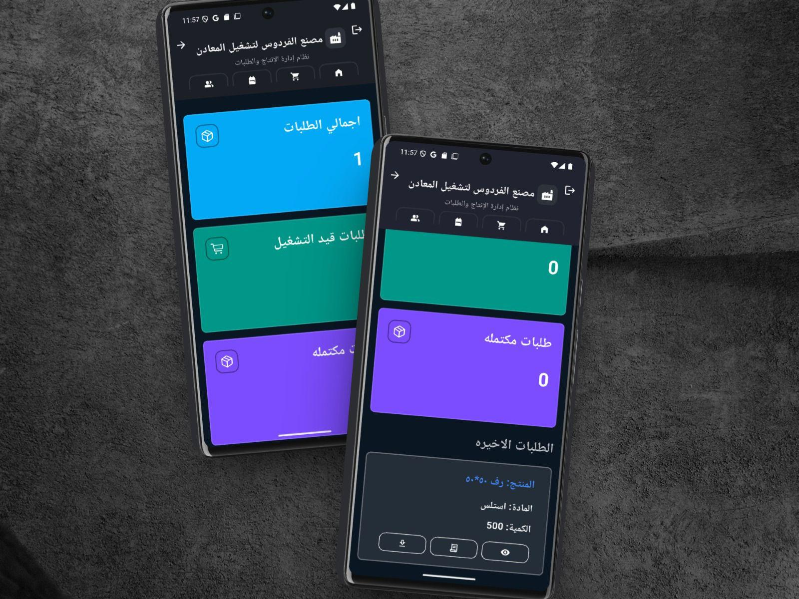
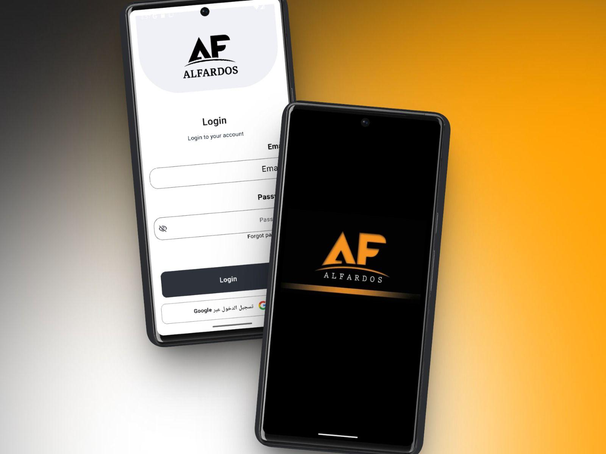
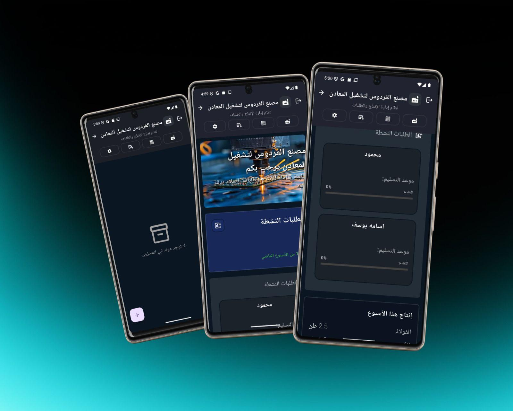
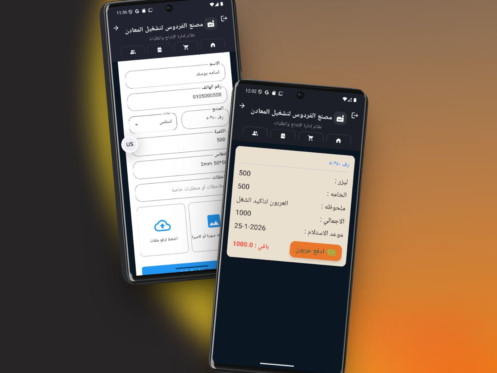
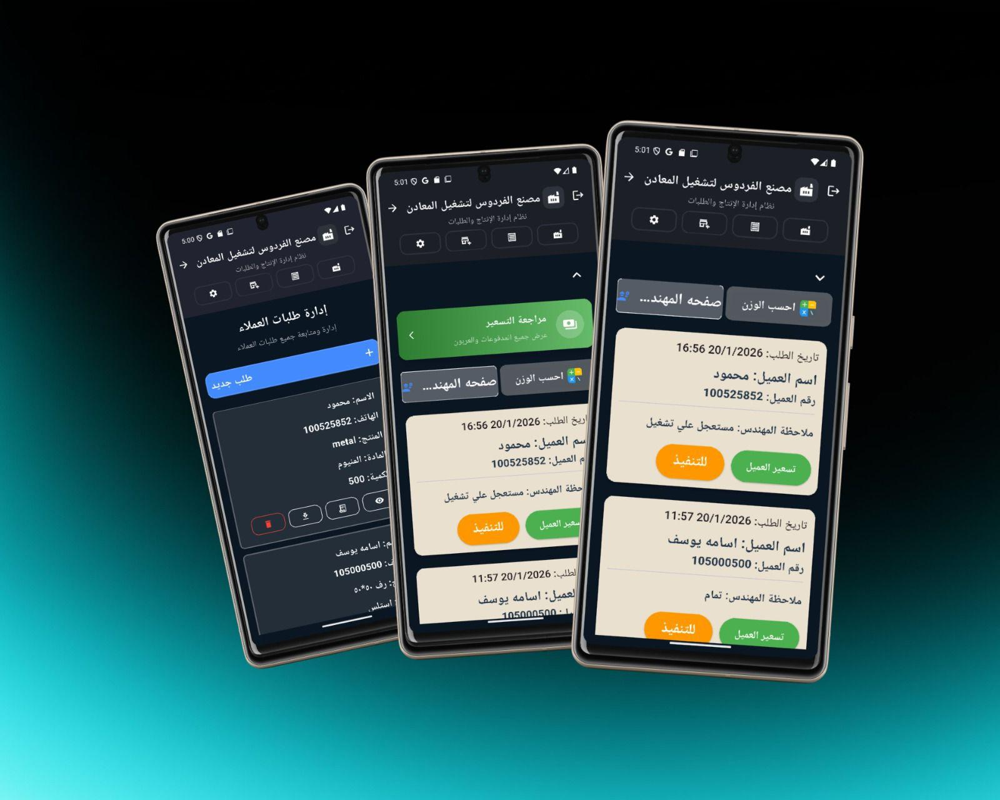

<div align="center">



<br/>

[](https://flutter.dev)
[](https://firebase.google.com)
[](https://bloclibrary.dev)
[](#why-it-exists)

**The order management system of Al-Fardos, a metal processing factory.**
Clients place and track orders, engineers prepare drawings, the office prices and schedules,
and floor workers execute. Everyone works from the same live data.

نظام إدارة طلبات مصنع الفردوس لتشغيل المعادن — أربع واجهات لأربعة أدوار في تطبيق واحد.

</div>

---

## Why it exists

A metal workshop has four very different kinds of users: clients, engineers, the office
(admin and accounting) and floor workers. Before this app, orders moved between them through
phone calls, WhatsApp and paper notes. Pricing took days, orders got lost, and clients had no
idea where their order was.

Al-Fardos Factory puts the whole order lifecycle in one place, from the client's request to
engineering review, pricing, payment and production, and it is used every day at the factory.

## Screenshots

<table>
  <tr>
    <td width="50%"><br/><sub><b>Splash and sign in</b> · one login, routed by role</sub></td>
    <td width="50%"><br/><sub><b>Client home</b> · active orders and production progress</sub></td>
  </tr>
  <tr>
    <td width="50%"><br/><sub><b>New order and pricing</b> · specs, drawings upload, cost breakdown</sub></td>
    <td width="50%"><br/><sub><b>Admin dashboard</b> · total, in-production and completed counters</sub></td>
  </tr>
  <tr>
    <td width="50%"><br/><sub><b>Pricing form and chat</b> · material and laser cost, delivery date</sub></td>
    <td width="50%"><br/><sub><b>Order management</b> · client and admin views of the same order</sub></td>
  </tr>
  <tr>
    <td width="50%"><br/><sub><b>Customer service</b> · in-app support chat, call and WhatsApp</sub></td>
    <td></td>
  </tr>
</table>

## Four interfaces, one app

### Client
- Submit an order with product type, material (stainless steel, aluminum, ...), dimensions, quantity and notes, and attach drawings or photos from the phone
- Follow each order through the workflow: under engineering review, priced, in production, delivered
- Receive the price inside the app with a full breakdown (material, laser cutting, total) and confirm the deposit
- Talk to the factory in a chat attached to the order, instead of scattered WhatsApp threads

### Engineer
- A live feed of incoming orders with every spec and attachment the client sent
- Add technical notes and upload the finished drawing to the order
- Once the drawing is ready the order moves to pricing automatically

### Admin and accounting
- Live overview: total orders, in production, completed, and this week's output
- Central pricing: material cost, laser cost, total, delivery date and a note, pushed to the client instantly
- Browse any engineer's queue and follow live production
- Create an order on behalf of a client who does not use the app; it flows through the system like any other order
- Full order history with status tracking

### Floor worker
- A clean, ordered list of production jobs
- Two actions per job: **Start** and **Done**; the status updates everywhere in real time

## Tech stack

| Area | Choice |
|:--|:--|
| Framework | Flutter, Dart, Arabic RTL UI |
| State management | Bloc / Cubit (`flutter_bloc`, `equatable`) |
| Auth | Firebase Auth (email and Google sign-in), role-based routing |
| Data | Cloud Firestore with real-time listeners |
| Files | Cloudinary for images, `file_picker` / `image_picker` for drawings, `open_file` to view them |
| Notifications | Firebase Cloud Messaging |
| Security | Firebase App Check |
| Networking | `dio` |
| UI | `flutter_screenutil`, `awesome_dialog`, native splash and launcher icons |

```
lib/
  auth/        login, register, auth cubit, user repository
  client/      home, new order, order details, customer service chat
  admin/       dashboard, customer requests, engineers' queue, pricing review,
               live production follow-up, floor worker screen, services, settings
  core/        routing, theming, network, shared widgets
```

## Getting started

```bash
flutter pub get
flutterfire configure        # connect your own Firebase project
flutter run
```

Enable Email/Password and Google sign-in in Firebase Authentication, create Firestore and
Storage, and set a `role` field (`admin`, `eng`, `factor` or `client`) on each user document.

## Author

**Osama Yosef** · Flutter developer, Cairo

[](https://github.com/osama-Yosef)
[](https://www.linkedin.com/in/osama-yosef-819268319)
[](https://upwork.com/freelancers/~014ebd205ef38ca04c)
[](mailto:osamayosef038@gmail.com)
